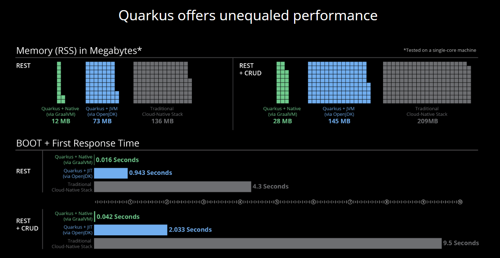
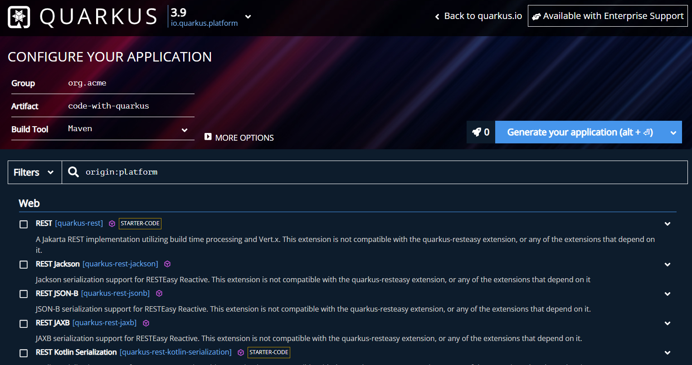

# Quarkus


## Course objective

*  Discover and use microservices with quarkus
*  Use JPA with databases
*  Use state-of-the-art architecture and most used technologies 

## Definitions

### Microservices


Microservices are a software development technique — a variation of service-oriented architecture (SOA) — that structures an application as a set of loosely coupled services. Independent microservices communicate with each other using programming language-independent APIs.


REST APIs are often used to connect each microservices to the others. A noticeable advantage is that during a critical micriservice update, only the microservice containing this resource will be updated, the entire application remaining compatible with the modification, unlike the entire application in a classical architecture.

### REST

**REST (Representational State Transfer)** is an architectural style for designing networked applications. It relies on a stateless, client-server communication protocol, most commonly HTTP.

In REST architecture, resources are represented by URIs (Uniform Resource Identifiers), and interactions with these resources are performed using standard HTTP methods:

1. **GET**: Retrieves a representation of a resource without altering its state.
2. **POST**: Creates a new resource.
3. **PUT**: Updates an existing resource or creates a new one if it doesn't exist.
4. **DELETE**: Removes a resource.
5. **PATCH**: Applies partial modifications to a resource.
6. **OPTIONS**: Describes the communication options for the target resource.
7. **HEAD**: Similar to GET, but retrieves only the headers for the resource without the body.

These HTTP methods, combined with URIs, form the foundation of RESTful APIs, enabling clients to interact with resources over the web in a predictable and standardized manner.

Example: Collection ressource like [http://api.exemple.com/collection/]()


Example [Swagger](https://editor.swagger.io/)

Plus d'infos: [HTTP](https://fr.wikipedia.org/wiki/Hypertext_Transfer_Protocol), [REST](https://fr.wikipedia.org/wiki/Representational_state_transfer)


### Why Quarkus?

Quarkus is a Java framework designed for building Kubernetes-native, lightweight, and fast Java applications. It's particularly optimized for running Java in containerized environments and serverless architectures. Quarkus offers features like ahead-of-time compilation, low memory consumption, and fast startup times, making it suitable for microservices and cloud-native applications.

Quarkus supports a variety of programming models and extensions, allowing developers to easily integrate with other technologies such as RESTful services, messaging systems, databases, and more. It's built to support popular Java standards like CDI (Contexts and Dependency Injection), JAX-RS (Java API for RESTful Web Services), and Hibernate ORM (Object-Relational Mapping).

Studying Quarkus can offer several advantages compared to other Java frameworks. Here are some reasons why one might choose to study Quarkus:

1. **Cloud-Native Focus**: Quarkus is designed specifically for cloud-native applications. It's optimized for running Java workloads efficiently in containerized environments like Kubernetes and serverless platforms. This focus on cloud-native development aligns with modern software development trends.

2. **Fast Startup and Low Memory Consumption**: Quarkus is known for its fast startup times and low memory usage. This is achieved through features like ahead-of-time (AOT) compilation, GraalVM compatibility, and optimized runtime behaviors. These characteristics make Quarkus suitable for microservices and serverless architectures where quick scaling and efficient resource utilization are critical.

3. **Developer Productivity**: Quarkus aims to enhance developer productivity by providing a familiar development experience with support for popular Java standards like CDI, JAX-RS, and Hibernate ORM. Additionally, it offers a wide range of extensions for integrating with various technologies and frameworks, reducing the need for manual configuration and boilerplate code.

4. **Microservices and Reactive Programming**: Quarkus supports reactive programming paradigms and is well-suited for building microservices architectures. It provides support for reactive streams and non-blocking I/O, enabling developers to build highly scalable and responsive applications.

5. **Integration with GraalVM**: Quarkus can be compiled ahead-of-time using GraalVM, which allows developers to create native executables. These native executables have faster startup times and lower memory overhead compared to traditional Java applications running on a Java Virtual Machine (JVM). This capability makes Quarkus suitable for resource-constrained environments and environments where high performance is a priority.

6. **Vibrant Ecosystem and Community**: Quarkus has gained significant traction within the Java community, leading to a vibrant ecosystem of extensions, libraries, and community support. This active community contributes to the continuous improvement and evolution of the framework, providing developers with access to a wealth of resources and expertise.

In summary, studying Quarkus can provide valuable insights and skills for developing modern, cloud-native Java applications with a focus on performance, scalability, and developer productivity. Its advantages in terms of cloud-native optimization, fast startup times, low resource consumption, and extensive ecosystem make it a compelling choice for Java developers looking to stay ahead in the rapidly evolving landscape of software development.


**Performances:**




**Downsides of Quarkus:**

1. **Learning Curve**: Quarkus introduces new concepts and optimizations, leading to a steep learning curve for developers unfamiliar with cloud-native environments and GraalVM. Reactive programming must be used for specific applications.

2. **Compatibility Challenges**: While Quarkus aims for compatibility with existing Java standards and libraries, compatibility challenges may arise, particularly with libraries relying on reflection or dynamic class loading.

3. **Complexity of Native Compilation**: While native compilation with GraalVM offers performance benefits, it introduces complexities such as dependency management, reflection usage, and platform-specific nuances.

**Conclusion**

There are a lot more advantages than downsides. Moreover, there is no need to use Native compilation.

In addition Quarkus as a few other frameworks implements the [Eclipse Microprofile specification](https://microprofile.io) wich is a subset of the JEE specification tailored for cloud native application.

Like legacy JEE frameworks, you can switch with almost no efforts to an other Microprofile implementation.

### Quarkus web configuration tool


The site [code.quarkus.io](https://code.quarkus.io/) allows you to generate all the project dependencies and creates the skeleton of the application.




## Hello REST World


### Prerequisites

* [java 21 Mandrel ](https://github.com/graalvm/mandrel/releases)
* [java 21 Mandrel Windows](https://github.com/graalvm/mandrel/releases/download/mandrel-24.0.0.0-Final/mandrel-java22-windows-amd64-24.0.0.0-Final.zip)
* [java 21 Mandrel Linux](https://github.com/graalvm/mandrel/releases/download/mandrel-24.0.0.0-Final/mandrel-java22-linux-amd64-24.0.0.0-Final.tar.gz)
* [maven 3.9.6](https://dlcdn.apache.org/maven/maven-3/3.9.6/binaries/apache-maven-3.9.6-bin.zip)
* docker
* [IntelliJ (recommended)](https://www.jetbrains.com/fr-fr/community/education/#students) or [VsCode](https://code.visualstudio.com/download)
* 
  *Git


#### Under linux

```bash
sudo apt install g++ zlib1g-dev libfreetype6-dev
mkdir ~/maven
cd ~/maven
wget https://dlcdn.apache.org/maven/maven-3/3.9.6/binaries/apache-maven-3.9.6-bin.zip
unzip apache-maven-3.9.6-bin.zip
mkdir ~/Mandrel
cd ~/Mandrel
wget https://github.com/graalvm/mandrel/releases/download/mandrel-24.0.0.0-Final/mandrel-java22-linux-amd64-24.0.0.0-Final.tar.gz
tar xf mandrel-java22-linux-amd64-24.0.0.0-Final.tar.gz
# Dans bashrc / zshrc
export M2_HOME="~/maven/apache-maven-3.9.6-bin"
export JAVA_HOME="~/Mandrel/mandrel-java21-24.0.0.0-Final"
export GRAALVM_HOME="${JAVA_HOME}"
export PATH="${JAVA_HOME}/bin:${M2_HOME}/bin:${PATH}"
alias quarkus="mvn  -DquarkusRegistryClient=false"
# fin
mvn io.quarkus.platform:quarkus-maven-plugin:3.8.3:create  -DprojectGroupId=my-groupId -DprojectArtifactId=my-artifactId
cd my-artifactId
quarkus quarkus:add-extension -Dextensions='quarkus-resteasy-reactive'
mvn package -Pnative
./target/*-runner
```

#### Under windows

```bash
powershell -c "Invoke-WebRequest -OutFile quarkus.zip -Uri https://code.quarkus.io/d?e=io.quarkus:quarkus-resteasy"
powershell -c "Expand-Archive -Path quarkus.zip -DestinationPath . -Force"
cd code-with-quarkus
mvnw package -Pnative -Dquarkus.native.container-build=true -Dquarkus.native.builder-image=quay.io/quarkus/ubi-quarkus-mandrel-builder-image:jdk-22
docker build -f src/main/docker/Dockerfile.native -t my-quarkus-mandrel-app .
docker run -i --rm -p 8080:8080 my-quarkus-mandrel-app
```

### Docker or Podman

Docker is a set of utilities that use OS-level virtualization to deliver software in packages called containers. Containers are isolated from one another and bundle their software, libraries, and configuration files; they can communicate with each other through well-defined channels.

#### Installing Docker

Quarkus use Testcontainers, and therefore also Docker, to ease the management of different technical services (database, monitoring…) during development. Our workshop also uses Docker to manage these services in a production-style deployment. So for this, we need to install `docker` and `docker compose` Installation instructions are available on the following page:

-   Windows - [https://docs.docker.com/docker-for-windows/install/](https://docs.docker.com/docker-for-windows/install/) (version 20+)


<table><tbody><tr><td><i title="Note"></i></td><td>If you do not have a Docker licence, you might prefer <code>podman</code> (<a href="https://podman.io/">https://podman.io/</a>) instead of <code>docker</code>. To install <code>podman</code> and <code>podman-compose</code> please follow the instructions at <a href="https://quarkus.io/guides/podman">https://quarkus.io/guides/podman</a>. Do not forget the extra steps to configure the testcontainers library. As a convenience you can even alias <code>docker</code> to <code>podman</code>.</td></tr></tbody></table>

#### Checking for Docker Installation

Once installed, check that both `docker` and `docker compose` are available in your `PATH`. For that, execute the following commands:

You should see something like this:

```
Docker version 20.10.8, build 3967b7d
Cloud integration: v1.0.24
Version:           20.10.14
API version:       1.41
```

Then, check the Docker Compose version:

Docker compose being a separate utility, you should get a different version than Docker itself:

```
Docker Compose version v2.5.0
```

Finally, run your first container as follows:

For the first time, this will download the `hello-world` image from the Docker Hub and run it. You should get something like this:

```
Hello from Docker!
This message shows that your installation appears to be working correctly.

To generate this message, Docker took the following steps:
1. The Docker client contacted the Docker daemon.
2. The Docker daemon pulled the "hello-world" image from the Docker Hub.
(amd64)
3. The Docker daemon created a new container from that image which runs the
executable that produces the output you are currently reading.
4. The Docker daemon streamed that output to the Docker client, which sent it
to your terminal.

To try something more ambitious, you can run an Ubuntu container with:
$ docker run -it ubuntu bash

Share images, automate workflows, and more with a free Docker ID:
 https://hub.docker.com/

For more examples and ideas, visit:
 https://docs.docker.com/get-started/
```

##### Some Docker Commands

Docker is a command-line utility where you can use several parameters and options to start/stop a container. You invoke `docker` with zero, one, or several command-line options with the container or image ID you want to work with. Docker comes with several options that are described in the documentation if you need more help To get some help on the commands and options, you can type, use the following command:

```bash
$ docker help

Usage:  docker [OPTIONS] COMMAND

$ docker help attach

Usage:  docker attach [OPTIONS] CONTAINER

Attach local standard input, output, and error streams to a running container
```

Here are some commands that you will be using to start/stop containers in this workshop.

-   `docker container ls`: Lists containers.

-   `docker container start CONTAINER`: Starts one or more stopped containers.

-   `docker compose -f docker-compose.yaml up -d`: Starts all containers defined in a Docker Compose file.

-   `docker compose -f docker-compose.yaml down`: Stops all containers defined in a Docker Compose file.


 

### Build file

```xml title="pom.xml"
<?xml version="1.0" encoding="UTF-8"?>
<project xmlns="http://maven.apache.org/POM/4.0.0" xmlns:xsi="http://www.w3.org/2001/XMLSchema-instance" xsi:schemaLocation="http://maven.apache.org/POM/4.0.0 https://maven.apache.org/xsd/maven-4.0.0.xsd">
  <modelVersion>4.0.0</modelVersion>
  <groupId>org.acme</groupId>
  <artifactId>code-with-quarkus</artifactId>
  <version>1.0.0-SNAPSHOT</version>

  <properties>
    <compiler-plugin.version>3.12.1</compiler-plugin.version>
    <maven.compiler.release>21</maven.compiler.release>
    <project.build.sourceEncoding>UTF-8</project.build.sourceEncoding>
    <project.reporting.outputEncoding>UTF-8</project.reporting.outputEncoding>
    <quarkus.platform.artifact-id>quarkus-bom</quarkus.platform.artifact-id>
    <quarkus.platform.group-id>io.quarkus.platform</quarkus.platform.group-id>
    <quarkus.platform.version>3.9.1</quarkus.platform.version>
    <skipITs>true</skipITs>
    <surefire-plugin.version>3.2.5</surefire-plugin.version>
  </properties>

  <dependencyManagement>
    <dependencies>
      <dependency>
        <groupId>${quarkus.platform.group-id}</groupId>
        <artifactId>${quarkus.platform.artifact-id}</artifactId>
        <version>${quarkus.platform.version}</version>
        <type>pom</type>
        <scope>import</scope>
      </dependency>
    </dependencies>
  </dependencyManagement>

  <dependencies>
    <dependency>
      <groupId>io.quarkus</groupId>
      <artifactId>quarkus-arc</artifactId>
    </dependency>
    <dependency>
      <groupId>io.quarkus</groupId>
      <artifactId>quarkus-rest</artifactId>
    </dependency>
    <dependency>
      <groupId>io.quarkus</groupId>
      <artifactId>quarkus-junit5</artifactId>
      <scope>test</scope>
    </dependency>
    <dependency>
      <groupId>io.rest-assured</groupId>
      <artifactId>rest-assured</artifactId>
      <scope>test</scope>
    </dependency>
  </dependencies>

  <build>
    <plugins>
      <plugin>
        <groupId>${quarkus.platform.group-id}</groupId>
        <artifactId>quarkus-maven-plugin</artifactId>
        <version>${quarkus.platform.version}</version>
        <extensions>true</extensions>
        <executions>
          <execution>
            <goals>
              <goal>build</goal>
              <goal>generate-code</goal>
              <goal>generate-code-tests</goal>
            </goals>
          </execution>
        </executions>
      </plugin>
      <plugin>
        <artifactId>maven-compiler-plugin</artifactId>
        <version>${compiler-plugin.version}</version>
        <configuration>
          <compilerArgs>
            <arg>-parameters</arg>
          </compilerArgs>
        </configuration>
      </plugin>
      <plugin>
        <artifactId>maven-surefire-plugin</artifactId>
        <version>${surefire-plugin.version}</version>
        <configuration>
          <systemPropertyVariables>
            <java.util.logging.manager>org.jboss.logmanager.LogManager</java.util.logging.manager>
            <maven.home>${maven.home}</maven.home>
          </systemPropertyVariables>
        </configuration>
      </plugin>
      <plugin>
        <artifactId>maven-failsafe-plugin</artifactId>
        <version>${surefire-plugin.version}</version>
        <executions>
          <execution>
            <goals>
              <goal>integration-test</goal>
              <goal>verify</goal>
            </goals>
          </execution>
        </executions>
        <configuration>
          <systemPropertyVariables>
            <native.image.path>${project.build.directory}/${project.build.finalName}-runner</native.image.path>
            <java.util.logging.manager>org.jboss.logmanager.LogManager</java.util.logging.manager>
            <maven.home>${maven.home}</maven.home>
          </systemPropertyVariables>
        </configuration>
      </plugin>
    </plugins>
  </build>

  <profiles>
    <profile>
      <id>native</id>
      <activation>
        <property>
          <name>native</name>
        </property>
      </activation>
      <properties>
        <skipITs>false</skipITs>
        <quarkus.package.type>native</quarkus.package.type>
      </properties>
    </profile>
  </profiles>
</project>

```

### Hello Code

```java title="src/main/java/org/acme/GreatingResource.java"
package org.acme;

import jakarta.ws.rs.GET;
import jakarta.ws.rs.Path;
import jakarta.ws.rs.Produces;
import jakarta.ws.rs.core.MediaType;

@Path("/hello")
public class GreetingResource {

  @GET
  @Produces(MediaType.TEXT_PLAIN)
  public String hello() {
    return "Hello from Quarkus REST";
  }
}
```

No main method is required, although it is possible to have it.

Here the ```@Path("/hello")``` instanciate the class and create a GET (With ```@GET```) REST endpoint ```/hello``` producing text (```@Produces(MediaType.TEXT_PLAIN)```) which is binded to the ```hello()``` method

### Launching

Many ways:

* With IDE Run asQuarkus Application
* With maven ```mvn quarkus:dev```
* Launching the generated jar: ```java -jar target/quarkus-app/*.jar```


### Manual tests

```curl localhost:8080```

or with the browser:

```firefox http://localhost:8080```

8080 is the default Quarkus server port, change it with (for example) ```quarkus.http.port=8081``` in ```src/main/resource/application.properties```


### Junit Tests


```java
package org.acme;

import io.quarkus.test.junit.QuarkusTest;
import org.junit.jupiter.api.Test;

import static io.restassured.RestAssured.given;
import static org.hamcrest.CoreMatchers.is;

@QuarkusTest
class ExampleResourceTest {
  @Test
  void testHelloEndpoint() {
    given()
            .when().get("/hello")
            .then()
            .statusCode(200)
            .body(is("Hello from Quarkus REST"));
  }

}
```

## Concepts

### Dev mode

[Official Guide](https://quarkus.io/guides/dev-mode-differences)
* Offer a web UI to help the devlopper under `/q/dev` of your url.
* Live reload of the application when a Rest call is made.
* And many others: Swagger UI, Database imports, documentation,...


### Configuration / Profil

[Official Guide](https://quarkus.io/guides/config-reference)

We often need to configure our application differently depending on the target environment. For example, the local development environment may be different from the production environment.

Configuration Profiles allow for multiple configurations in the same file or separate files and select between them via a profile name.

 #### Default Profiles
By default, Quarkus provides three profiles, that activate automatically in certain conditions:

* **dev** - Activated when in development mode (i.e. quarkus:dev)

* **test** - Activated when running tests

* **prod** - The default profile when not running in development or test mode

Example:
```properties
bar=”hello”
baz=”bonjour”
%dev.bar=”hallo”
%prod.baz="Hej"
```

#### Injecting configuration

```java
@ConfigProperty(name = "greeting.message") 
String message;
```

### CDI

[Official Guide](https://quarkus.io/guides/cdi-reference)

```java
@ApplicationScoped //Instanciate the class
public class CounterBean {

    @Inject //	A package-private injection field
    CounterService counterService; 

    void onMessage(@Observes Event msg) { //A package-private observer method. 
    }
}
```


### References

[infoq.com/articles/microservicilities-quarkus/](https://www.infoq.com/articles/microservicilities-quarkus/)