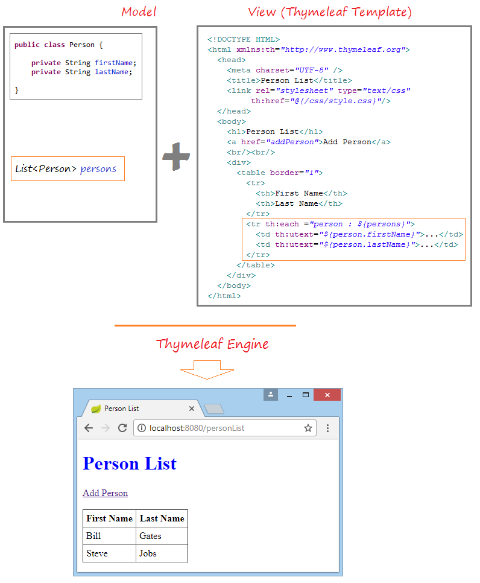

# Spring Boot


## Objectifs du cours

*  Découverte et utilisation de microservices
*  Utiliser JPA pour communiquer avec des bases de données
*  Valider et sécuriser les données
*  Gestion d'erreurs

## Notions et définitions

### Microservice

Les microservices sont une technique de développement logiciel — une variante de l'architecture orientée services (SOA) — qui structure une application comme un ensemble de services faiblement couplés. Les microservices indépendants communiquent les uns avec les autres en utilisant des API indépendantes du langage de programmation.


Des API REST sont souvent employées pour relier chaque microservice aux autres. Un avantage avancé est que lors d'un besoin critique de mise à jour d'une ressource, seul le microservice contenant cette ressource sera mis à jour, l'ensemble de l'application restant compatible avec la modification, contrairement à la totalité de l'application dans une architecture classique.

### REST

Rappels rapide REST:

REST (pour REpresentational State Transfer) ne décrit pas une implémentation mais un style d’architecture qui suit différents principes :

*  __client-serveur__: les responsabilités sont séparées entre le client et le serveur. L’interface utilisateur est séparée de celle du stockage des données. Cela permet aux deux d’évoluer indépendamment (contrairement à des applications qui réalisent des requêtes directement en base de données par exemple…).
*  __sans état__: la requête envoyée par le client doit être auto-suffisante : ne pas nécessiter de sauvegarder un état sur le serveur
*  __mise en cache__ : la possibilité pour le serveur de spécifier les réponses pouvant être mises en cache
*  __une interface uniforme__ : chaque ressource est identifiée unitairement, les ressources ont des représentations définies
*  __un système hiérarchisé par couche__: les états de l’application sont représentés par des ressources individuelles. L’ensemble de l’information n’est pas envoyée dans une ressource unique.


À noter qu’on assimile « API REST » avec l’application de ce style d’architecture sur le protocole HTTP et en utilisant le format d’échange de données JSON.
Avec le protocole HTTP définit les méthodes suivantes: __GET__, __POST__, __PUT__, __PATCH__ et __DELETE__.

Exemple: Ressource collection, telle que [http://api.exemple.com/collection/]()

*  __GET__: Récupère les URI des ressources membres de la ressource collection dans le corps de la réponse.
*  __POST__: Crée une ressource membre dans la ressource collection en utilisant les instructions du corps de la requête. L'URI de la ressource membre créée est attribué automatiquement et retourné dans le champ d'en-tête Location de la réponse.
*  __PUT__: Remplace toutes les représentations des ressources membres de la ressource collection par la représentation dans le corps de la requête, ou crée la ressource collection si elle n'existe pas.
*  __PATCH__ :Met à jour toutes les représentations des ressources membres de la ressource collection en utilisant les instructions du corps de la requête, ou crée éventuellement la ressource collection si elle n'existe pas.
*  __DETELE__: Supprime toutes les représentations des ressources membres de la ressource collection.

Exemple [Swagger](https://editor.swagger.io/)

Plus d'infos: [HTTP](https://fr.wikipedia.org/wiki/Hypertext_Transfer_Protocol), [REST](https://fr.wikipedia.org/wiki/Representational_state_transfer)


### MVC


### Pourquoi Spring Boot?

_Définition_ : __Spring__ est un Framework de développement d'applications Java, qui apporte plusieurs fonctionnalités comme Spring Security, SpringMVC, Spring Batch, Spring Data, etc. Ces Frameworks ont pour objectif de faciliter la tâche aux développeurs. Malheureusement, leurs mises en œuvre deviennent très complexes à travers les fichiers de configuration XML qui ne cessent de grossir, et une gestion des dépendances fastidieuse. C'est pour répondre à cette inquiétude que le projet Spring Boot a vu le jour.

_Définition_ : __Spring Boot__ est un sous projet de Spring qui vise à rendre Spring plus facile d'utilisation en élimant plusieurs étapes de configuration. L'objectif de Spring Boot est de permettre aux développeurs de se concentrer sur des tâches techniques et non des tâches de configurations, de déploiements, etc. Ce qui a pour conséquences un gain de temps et de productivité.


Spring Boot apporte à Spring une très grande simplicité d'utilisation :

*  Il facilite notamment la création, la configuration et le déploiement d'une application complète. On n'a plus besoin des fichiers XML à configurer (pas besoin du fichier du descripteur de déploiement web.xml dans le cas d'une application web).
*  Spring Boot permet de déployer très facilement une application dans plusieurs environnements sans avoir à écrire des scripts. Pour ce faire, une simple indication de l'environnement (développement ou production) dans le fichier de propriétés (.properties) suffit à déployer l'application dans l'un ou l'autre environnement. Ceci est rendu possible grâce à la notion de profil à déclarer toujours dans le fichier de propriétés.
*  Spring Boot possède un serveur d'application Tomcat embarqué afin de faciliter le déploiement d'une application web. Il est possible d'utiliser un serveur autre ou externe, grâce à une simple déclaration dans le fichier pom.xml.
*  Spring Boot permet de mettre en place un suivi métrique de l'application une fois déployée sur le serveur afin de suivre en temps réel l'activité du serveur, ceci grâce à spring-boot-starter-actuator.


### Outil configuration spring boot

Le site [start.spring.io](https://start.spring.io/) permet de générer l'ensemble des dépendances du projet et créé le squelette de l'application.


## Hello REST World

### Prérequis

*  Java 1.8
*  Maven
*  [Spring Tool Suite](https://spring.io/tools)
*  Git
*  Linux?


### Fichier de build

```xml
<?xml version="1.0" encoding="UTF-8"?>
<project xmlns="http://maven.apache.org/POM/4.0.0" xmlns:xsi="http://www.w3.org/2001/XMLSchema-instance"
	xsi:schemaLocation="http://maven.apache.org/POM/4.0.0 https://maven.apache.org/xsd/maven-4.0.0.xsd">
	<modelVersion>4.0.0</modelVersion>
	<parent>
		<groupId>org.springframework.boot</groupId>
		<artifactId>spring-boot-starter-parent</artifactId>
		<version>2.3.3.RELEASE</version>
		<relativePath/> <!-- lookup parent from repository -->
	</parent>
	<groupId>com.example</groupId>
	<artifactId>demo</artifactId>
	<version>0.0.1-SNAPSHOT</version>
	<name>demo</name>
	<description>Demo project for Spring Boot</description>

	<properties>
		<java.version>1.8</java.version>
	</properties>

	<dependencies>
		<dependency>
			<groupId>org.springframework.boot</groupId>
			<artifactId>spring-boot-starter-thymeleaf</artifactId>
		</dependency>
		<dependency>
			<groupId>org.springframework.boot</groupId>
			<artifactId>spring-boot-starter-web</artifactId>
		</dependency>

		<dependency>
			<groupId>org.springframework.boot</groupId>
			<artifactId>spring-boot-devtools</artifactId>
			<scope>runtime</scope>
			<optional>true</optional>
		</dependency>
		<dependency>
			<groupId>org.springframework.boot</groupId>
			<artifactId>spring-boot-starter-test</artifactId>
			<scope>test</scope>
			<exclusions>
				<exclusion>
					<groupId>org.junit.vintage</groupId>
					<artifactId>junit-vintage-engine</artifactId>
				</exclusion>
			</exclusions>
		</dependency>
	</dependencies>

	<build>
		<plugins>
			<plugin>
				<groupId>org.springframework.boot</groupId>
				<artifactId>spring-boot-maven-plugin</artifactId>
			</plugin>
		</plugins>
	</build>

</project>
```

### Classe de lancement: com.example.demo.DemoApplication

```java

package com.example.demo;

import org.springframework.boot.SpringApplication;
import org.springframework.boot.autoconfigure.SpringBootApplication;

@SpringBootApplication
public class DemoApplication {

	public static void main(String[] args) {
		SpringApplication.run(DemoApplication.class, args);
	}

	// Bean permettant de lister la liste des bens Spring instanciés
	@Bean
	public CommandLineRunner commandLineRunner(ApplicationContext ctx) {
		return args -> {
			System.out.println("Let's inspect the beans provided by Spring Boot:");

			String[] beanNames = ctx.getBeanDefinitionNames();
			Arrays.sort(beanNames);
			for (String beanName : beanNames) {
				System.out.println(beanName);
			}

		};
	}

}
```

La classe DemoApplication contient la méthode ```void main(String[] args)``` nécessaire dans une application Spring Boot, et permet l'exécution de celle-ci : c'est le point d'entrée de l'application.

La classe de démarrage de l'application DemoApplication doit être à la racine du package principal si on veut permettre à Spring de scanner les sous-packages en utilisant l'annotation **@SpringBootApplication**.

L'annotation @SpringBootApplication est centrale dans une application Spring Boot et permet de **scanner le package courant et ses sous-packages**.

Elle est équivalente à l'ensemble des annotations
```
  @Configuration
  @EnableAutoConfiguration
  @ComponentScan
```

*  @Configuration permet de configurer une classe comme une source de définition des beans Spring.
*  @EnableAutoConfiguration ajoute l'ensemble des beans du classpath.
*  @ComponentScan autorise Spring à rechercher tous les composants, les configurations et autres services de l'application et à initialiser tous les contrôleurs.


### Le contrôleur com.example.springboot.HelloController


```java
package com.example.springboot;

import org.springframework.web.bind.annotation.RestController;
import org.springframework.web.bind.annotation.RequestMapping;

@RestController
public class HelloController {

	@RequestMapping("/")
	public String index() {
		return "Greetings from Spring Boot!";
	}

}
```

Cette classe est annotée @RestController, ce qui veut dire qu'elle est prête à être utilisée par Spring MVC pour gérer des requêtes web.

**@RequestMapping** associe / à la méthode index().Quand la méthode est invoquée depuis un navigateur web ou la commande curl elle retourne le texte du return.

L'annotation @RestController, est une combinaison des annotations @Controller et @ResponseBody, créée une réponse web retournant de la **data** plutôt qu'une vue.

### Lancement

Plusieurs possibilités:

* Avec Eclipse Run as Spring boot Application
* Avec maven ```mvn spring-boot:run```
* En lançant le main du jar généré


### Tests manuels

Il suffit de faire une requête http vers localhost:8080

  ```curl localhost:8080```

ou avec le navigateur:

  ```firefox http://localhost:8080```

8080 est le port par défaut du serveur web embarqué par spring boot.


### Tests unitaires Junit


```java
package com.example.springboot;

import static org.hamcrest.Matchers.equalTo;
import static org.springframework.test.web.servlet.result.MockMvcResultMatchers.content;
import static org.springframework.test.web.servlet.result.MockMvcResultMatchers.status;

import org.junit.jupiter.api.Test;

import org.springframework.beans.factory.annotation.Autowired;
import org.springframework.boot.test.autoconfigure.web.servlet.AutoConfigureMockMvc;
import org.springframework.boot.test.context.SpringBootTest;
import org.springframework.http.MediaType;
import org.springframework.test.web.servlet.MockMvc;
import org.springframework.test.web.servlet.request.MockMvcRequestBuilders;

@SpringBootTest
@AutoConfigureMockMvc
public class HelloControllerTest {

	@Autowired
	private MockMvc mvc;

	@Test
	public void getHello() throws Exception {
		mvc.perform(MockMvcRequestBuilders.get("/").accept(MediaType.APPLICATION_JSON))
				.andExpect(status().isOk())
				.andExpect(content().string(equalTo("Greetings from Spring Boot!")));
	}
}
```


## Exo thymeleaf

Thymeleaf est un  Java HTML5 Template Engine qui peut travailler à la fois dans des environnements Web (Servlet) et celui de non Web. Il est mieux adapté pour diffuser XHTML/HTML5 sur View (View Layer) des applications Web basées sur MVC. Mais il peut traiter n'importe quel fichier XML même dans des environnements hors ligne (offline). Il fournit une intégration complète de Spring Framework​​​​​​​.


Le fichier modèle (Template file) de Thymeleaf est en substance un fichier de document ordinaire au format HTML5. Thymeleaf Engine (le moteur Thymeleaf) va lire un fichier modèle et le combiner avec des objets Java pour générer (generate) un autre document.



Voici ce que nous allons réaliser:


## Exo thymeleaf Security

[Tuto](https://www.thymeleaf.org/doc/articles/springsecurity.html)

Dépendances start.spring.io
	devtools
	web
	thymeleaf
	Security

Ajouter dans le pom généré:


```xml
		<dependency>
		   <groupId>org.thymeleaf.extras</groupId>
		   <artifactId>thymeleaf-extras-springsecurity5</artifactId>
		</dependency>
		<dependency>
			<groupId>org.springframework.boot</groupId>
			<artifactId>spring-boot-starter-security</artifactId>
		</dependency>
```

Un petit conseil: il vaut mieux supprimer tous les `.html` non nécessaire.

Classe de configuration de la sécurité:

```java
@Configuration
public class SecurityConfiguration extends WebSecurityConfigurerAdapter {

	protected void configure(final HttpSecurity http) throws Exception {
	    http
	        .formLogin()
	        .loginPage("/login")
	        .failureUrl("/login-error")
	      .and()
	        .logout()
	        .logoutSuccessUrl("/index");
	}
	@Bean
	@Override
	public UserDetailsService userDetailsService() {
		UserDetails user =
			 User.withDefaultPasswordEncoder()
				.username("user")
				.password("user")
				.roles("USER")
				.build();
		UserDetails admin =
				User.withDefaultPasswordEncoder()
				.username("admin")
				.password("admin")
				.roles("ADMIN")
				.build();

		return new InMemoryUserDetailsManager(user,admin);
	}
}
```


## Spring Controller

Quelle est la différence entre les annotations `@Controller` et `@RestController` dans Spring MVC?


### Controller
Les contrôleurs classiques peuvent être annotés avec l’annotation `@Controller` .

Il s’agit simplement d’une spécialisation de la classe `@Component` qui permet de détecter automatiquement les classes d’implémentation via le balayage du classpath.

`@Controller` est généralement utilisé en combinaison avec une annotation `@RequestMapping` utilisée dans les méthodes de traitement des demandes.

Voyons un exemple rapide du contrôleur Spring MVC:

```java
@Controller
@RequestMapping("books")
public class SimpleBookController {

    @GetMapping("/{id}", produces = "application/json")
    public @ResponseBody Book getBook(@PathVariable int id) {
        return findBookById(id);
    }

    private Book findBookById(int id) {
       //...
    }
}

```

La méthode de traitement de la demande est annotée avec `@ResponseBody` . Cette annotation active la sérialisation automatique de l’objet de retour dans HttpResponse .

### RestController

`@RestController` est une version spécialisée du contrôleur. Il inclut les annotations `@Controller` et `@ResponseBody` et simplifie donc la mise en œuvre du contrôleur:

```java
@RestController
@RequestMapping("books-rest")
public class SimpleBookRestController {

    @GetMapping("/{id}", produces = "application/json")
    public Book getBook(@PathVariable int id) {
        return findBookById(id);
    }

    private Book findBookById(int id) {
       //...
    }
}
```

Le contrôleur est annoté avec l’annotation `@RestController` ; par conséquent, le `@ResponseBody` n’est pas requis.

Chaque méthode de traitement des demandes de la classe de contrôleur sérialise automatiquement les objets renvoyés dans HttpResponse .


### Retourner une vue

Pour retourner une vue (Thymleaf par exemple), il suffit d'avoir un controller et de retourner la string correspondant au fichier de la vue.

```java
@Controller
public class MainController {

	// Login form
	@RequestMapping(value = { "/log-in", "/login" }, method = RequestMethod.GET)
	public String login() {
		return "login"; //retourne la page login.html
	}
}

```

### Autres annotations

* `@Component`
Cette annotation est utilisée sur les classes pour indiquer un composant Spring. L'annotation `@Component` marque la classe Java en tant que bean ou composant afin que le mécanisme d'analyse des composants de Spring puisse l'ajouter au contexte de l'application.

* `@Controller`
L'annotation @Controller est utilisée pour indiquer que la classe est un contrôleur Spring. Cette annotation peut être utilisée pour identifier les contrôleurs pour Spring MVC ou Spring WebFlux.

* `@Service`
Cette annotation est utilisée sur une classe. @Service marque une classe Java qui effectue certains traitements service, tels que l'exécution de la logique métier, l'exécution de calculs et l'appel d'API externes. Cette annotation est une forme spécialisée de l'annotation @Component destinée à être utilisée dans la couche de service.

* `@Repository`
Cette annotation est utilisée sur les classes Java qui accèdent directement à la base de données. L'annotation `@Repository` fonctionne comme un marqueur pour toute classe remplissant le rôle de référentiel ou d'objet d'accès aux données.

Cette annotation a une fonction de traduction automatique. Par exemple, lorsqu'une exception se produit dans @Repository, il existe un gestionnaire pour cette exception et il n'est pas nécessaire d'ajouter un bloc try-catch.